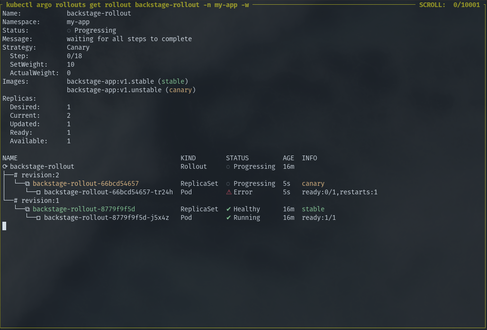

# Francesco Piva - Consensys Assignment

## Assignment Statement

> Create an **automated procedure** for **deploying** and **updating** a
> Backstage instance while **gracefully handling failures**. It would be nice to
> provide a way to **test your procedure locally** (for example, with containers)
> and a **document with instructions** on how to use your method.

## Assignment Requirements

> No particular technology is required you can choose to use whatever you like
> **Your procedure should be resilient to errors** and leave the installation in
> a **working state** even if something wrong happens during an update.

## Getting Started and Requirements

In order to streamline the way we test this, I have used `nix` to handle all
dependencies. Make sure you have a `nix` installed, as well as `direnv` and
once entering this projects' directory all dependencies should be installed.
All dependencies for this project are (should be) included in the `shell.nix`
file.

There's an `init.sh` script that boots up a `minikube` with add-ons and
`--cpus=4`.

If you don't want to install or use Nix (you're missing out ;-)) here are the
application I've used to roll out this project.

- `minikube`
- `kubectl`
- `helm`
- `docker`
- `docker-compose`
- `npm` or `npx`

## What's in the init.sh script

- Starting a local `minikube` with 4 CPUs and allowing `--insecure-registry`.
- Installs with `kubectl` Argo-CD and Argo-Rollouts.
- Adds the ArgoCD Application manifest:  `init-files/application-backstage.yaml`
- Builds the Backstage Docker Image and pushes it to the local `minikube` registry.

## How to use this project

When we roll-out the image of backstage: `backstage-app:stable` everything is fine,
this image is stable.

For the sake of the example, when we push any kind of changes in the Docker
image, and we adapt the image in the roll-out manifest, if anything is going
wrong, with the Canary Deployment we're implementing, them "faulty image" won't
run, but the "original" image will still be accessible.

## Technical choices, shortcuts and explanation

In order to test this locally and make a proper PoC here is the shortcuts I
have deliberately taken:

- Omitted the CICD: to promote, push to a registry any changes done to the
  Docker Backstage app image.
- Didn't fine-tune the Kube-Prometheus-Stack values.
- Did not adapt neither Nginx nor Istio.
- I have chosen to go with the Canaray Deployment method instead of the Blue-Green.
- The Analysis is very simple and looks only at CPU usage. This could be fine
  tuned to be using proper Istio or Nginx metrics. 

Unfortunately as I am currently with COVID I couldn't get the Analysis to work
properly to reflect this. But as the analysis is faulty, the new image doesn't
get deployed either. So we're still running a stable version of the backstage
app.

If I had some more time to fine tune this fun project: I would have allowed me
to implement the following features:

- A proper CICD
- Semnantic versioning promotion method for the Backstage Docker Image
- Argo Events: to monitor whenever an Argo Rollout gets triggered.
- Argo Workflows: to run a bunch of tests whenever a Rollout gets triggered.
- Proper metrics gathering in Prometheus for the Analysis.

I wish I had more time to achieve this.

## Test it locally

Fork this project, and run this command with your Github username:

`sed -i 's/chess-seventh/<YOUR_GH_USERNAME>/g' ./init-files/*`

Run `sh ./init.sh`.

You can then see the stable version of backstage running by running:

`kubectl argo rollouts get rollout backstage-rollout -n my-app -w`

To see that the application fails run:

`sed -i 's/v1.stable/v1.unstable/g' ./charts/backstage-app/*`

Commit and push the change to your repository and see the roll-out happening.

It will be stuck as the Analysis cannot run as the new Pod will be stuck in the
CrashBackLoop state.

ArgoCD takes some time to pick up the changes, but you can Refresh the
application in the UI to make this go faster.

The Backstage application will be up and running while the new version isn't accessible.

